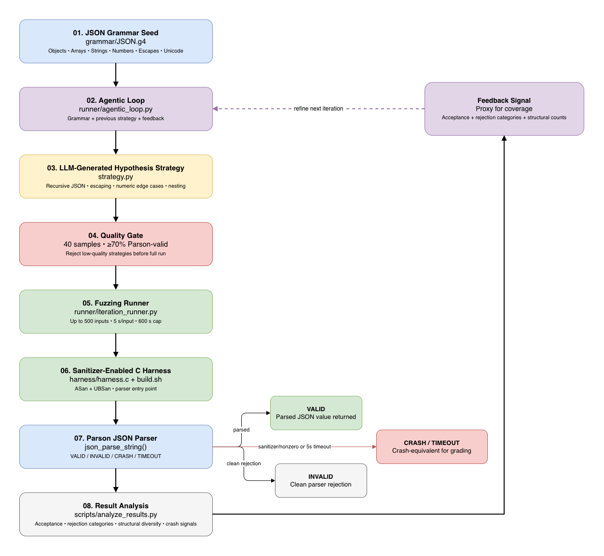

# Agentic Fuzzing

An LLM-driven, grammar-based fuzzing pipeline for the Parson JSON parser. The repository starts from an ANTLR JSON grammar, generates Hypothesis strategies through a bounded agentic loop, executes them against a sanitizer-enabled C harness, and records reproducible experiment artifacts.

> **Documentation split:** this README focuses on repository structure, implementation, execution, limits, and artifact provenance. The assignment-style discussion of **Design, Findings, and Challenges** is in [`docs/final_report.md`](docs/final_report.md).

## Target

- **Library:** Parson
- **Language:** C
- **Input format:** JSON
- **Pinned commit:** `ba29f4eda9ea7703a9f6a9cf2b0532a2605723c3`
- **Harnessed entry point:** `json_parse_string`

The harness intentionally targets the parser entry point. It does not claim coverage of Parson's serialization, validation, persistence, comment parsing, or deep-copy APIs.

## Repository Layout

```text
Agentic-Fuzzing/
├── grammar/JSON.g4
├── harness/{build.sh,harness.c,sample_inputs/}
├── strategies/baseline.py
├── runner/{agentic_loop.py,iteration_runner.py}
├── scripts/{analyze_results.py,triage_crashes.py,minimize_crash.py}
├── logs/baseline.log
├── experiments/{iteration_01..iteration_05,agentic_loop_usage.json}
└── docs/{final_report.md,iteration_summary.md,agentic_loop_log.md}
```

Each official iteration records the prompt, LLM responses/attempts, accepted strategy, quality-gate results, model metadata, generated inputs, execution log, analysis, and crash directory.

## End-to-End Pipeline

## End-to-End Fuzzing Pipeline



The pipeline starts from the JSON grammar, generates and quality-checks
an LLM-produced Hypothesis strategy, executes it through the sanitizer-
enabled harness, classifies parser outcomes, and feeds black-box feedback
back into the next agentic iteration.

[Open the editable Draw.io diagram](docs/agentic_fuzzing_pipeline.drawio)

## Grammar Seed

`grammar/JSON.g4` is the formal grammar seed. It covers objects, arrays, strings, escape sequences, Unicode escapes, numbers, booleans, null, and whitespace.

The grammar source is retained unchanged. Adaptation happens in the generated Hypothesis strategy: sampling weights and stress cases are changed from execution feedback without rewriting the grammar. The strategy therefore acts as the adaptive sampling policy over the formal grammar.

## Agentic Loop

`runner/agentic_loop.py`:

1. loads the grammar;
2. loads the previous strategy when available;
3. recomputes feedback from the baseline log and earlier `results.log` files;
4. builds and saves `llm_prompt.md`;
5. calls the configured LLM;
6. stores raw responses and the accepted `strategy.py`;
7. checks that `json_strategy` exists and is runnable;
8. applies the pre-run quality gate;
9. executes the bounded fuzzing iteration;
10. saves `analysis.txt` and model/usage metadata.

The next prompt is driven by **raw execution evidence**, not by blindly trusting a previous summary file. `analysis.txt` remains an auditable record of the completed iteration.

### Quality Gate

Before the full fuzzing budget:

- 40 examples are generated;
- at least 70% must be accepted by Parson;
- weak candidates are rejected and retried.

This prevents a syntactically valid but mostly rejected generator from consuming the main budget.

## Harness and Build

`harness/harness.c` reads one input file and passes it to `json_parse_string`.

- Successful parsing prints `VALID JSON`.
- Clean parser rejection prints `INVALID JSON`.
- Both are normal process outcomes.
- The returned Parson value is freed after successful parsing.

The public `json_parse_string` API does not expose detailed parse-error information through this harness, so rejection analysis uses the harness outcome plus analyzer-derived categories.

`harness/build.sh` compiles with:

```text
-g -O0 -Wall -Wextra -fsanitize=address,undefined
```

## Runner Outcome States

| State | Meaning |
|---|---|
| `VALID` | Parson accepted the input and exited normally. |
| `INVALID` | Parson rejected the input and exited normally. |
| `CRASH` | Nonzero exit or sanitizer evidence. |
| `TIMEOUT` | The 5-second per-input timeout expired. |

`TIMEOUT` is kept separate for diagnosis but is **crash-equivalent for grading**, because a parser hang can be a denial-of-service failure.

Campaign limits:

- 500 inputs per iteration
- 5 agentic iterations maximum
- 5 seconds per input
- 600 seconds / 10 minutes wall-clock cap per iteration

## Official Campaign

| Experiment | Total | Valid | Invalid | Crash | Timeout | Valid Rate |
|---|---:|---:|---:|---:|---:|---:|
| Baseline | 100 | 3 | 97 | 0 | 0 | 3.00% |
| Iteration 1 | 500 | 464 | 36 | 0 | 0 | 92.80% |
| Iteration 2 | 500 | 473 | 27 | 0 | 0 | 94.60% |
| Iteration 3 | 500 | 468 | 32 | 0 | 0 | 93.60% |
| Iteration 4 | 500 | 460 | 40 | 0 | 0 | 92.00% |
| Iteration 5 | 500 | 463 | 37 | 0 | 0 | 92.60% |

No `CRASH`, `TIMEOUT`, sanitizer report, or nonzero-exit finding was observed in the checked campaign.

See [`docs/final_report.md`](docs/final_report.md) for the interpretation of these results and the iteration-by-iteration strategy evolution.

## Feedback and Analysis

`scripts/analyze_results.py` summarizes valid/invalid/crash/timeout totals, acceptance rate, analyzer-derived invalid categories, and structural counts used as a diversity proxy.

There is no compiler coverage instrumentation. Structural counts are therefore **not code coverage**; they are observable properties of generated inputs used to steer sampling toward different JSON shapes and stress cases.

## Crash Triage

The official campaign produced no crash-equivalent cases, so there was nothing to deduplicate.

For future cases, `scripts/triage_crashes.py`:

1. keeps `CRASH` and `TIMEOUT` cases;
2. extracts sanitizer stack frames when available;
3. normalizes common suffixes such as `.cold`, `.isra.N`, and `.constprop.N`;
4. hashes normalized frames into `SIG-<hash>` signatures;
5. groups repeated crash-equivalent cases.

If stack frames are unavailable, it uses a status/exit/error fallback key.

```bash
venv/bin/python scripts/triage_crashes.py
venv/bin/python scripts/triage_crashes.py --json
```

## Crash Minimization

`scripts/minimize_crash.py` supports verification and Hypothesis shrinking.

```bash
venv/bin/python scripts/minimize_crash.py --input path/to/crash/input.json
```

```bash
venv/bin/python scripts/minimize_crash.py \
  --strategy experiments/iteration_05/strategy.py \
  --output minimized_reproducer.json
```

The script uses `json_strategy`, a `CRASH`/`TIMEOUT` predicate, `hypothesis.find()`, and standalone verification. No real failure was available to shrink in the official campaign.

## Token and Cost Record

| Model | Input Tokens | Output Tokens | Total Tokens | Estimated Cost |
|---|---:|---:|---:|---:|
| `gpt-5-mini` | 19,620 | 19,325 | 38,945 | about `$0.04` |

Usage is stored in `experiments/iteration_*/agentic_metadata.json` and `experiments/agentic_loop_usage.json`.

## Reproducibility

```bash
python -m pip install -r requirements.txt
./harness/build.sh
./harness/harness harness/sample_inputs/valid.json
./harness/harness harness/sample_inputs/invalid.json
```

Analyze the official logs:

```bash
venv/bin/python scripts/analyze_results.py \
  logs/baseline.log \
  experiments/iteration_01/results.log \
  experiments/iteration_02/results.log \
  experiments/iteration_03/results.log \
  experiments/iteration_04/results.log \
  experiments/iteration_05/results.log
```

Run a new campaign:

```bash
venv/bin/python runner/agentic_loop.py \
  --start-iteration 1 \
  --max-iterations 5 \
  --tests 500 \
  --model gpt-5-mini
```

The LLM-driven run requires the appropriate API environment configuration. Never commit credentials. Use `--allow-overwrite` only when intentionally replacing experiment artifacts.

## Artifact Provenance

| Artifact | Purpose |
|---|---|
| `grammar/JSON.g4` | Formal grammar seed |
| `strategies/baseline.py` | Baseline generator |
| `llm_prompt.md` | Exact prompt supplied to the LLM |
| `llm_response.txt` | Final accepted LLM response |
| `llm_response_attempt_*.txt` | Individual LLM attempts |
| `strategy.py` | Extracted runnable Hypothesis strategy |
| `agentic_metadata.json` | Model/token/usage metadata |
| `quality_gate_attempt_*.json` | Quality-gate records |
| `agentic_run_output.txt` | Iteration runner output |
| `inputs/` | Generated inputs |
| `results.log` | Per-input outcomes |
| `analysis.txt` | Completed-iteration analysis record |
| `crashes/` | Crash-equivalent artifacts, when present |

## Limitations

- Parser entry point only: `json_parse_string`.
- No compiler coverage instrumentation.
- Structural counts are diversity proxies, not coverage.
- Detailed parser error messages are unavailable.
- Strategy-based shrinking requires a strategy that can reproduce the failing class.
- No crash or vulnerability was found within the official budget.

## Documentation

- [`docs/final_report.md`](docs/final_report.md) — assignment-focused report: Design, Findings, Challenges.
- [`docs/iteration_summary.md`](docs/iteration_summary.md) — iteration execution summary.
- [`docs/agentic_loop_log.md`](docs/agentic_loop_log.md) — agentic-loop execution record.
- `experiments/iteration_*/` — prompts, responses, strategies, inputs, logs, analysis, and metadata.
